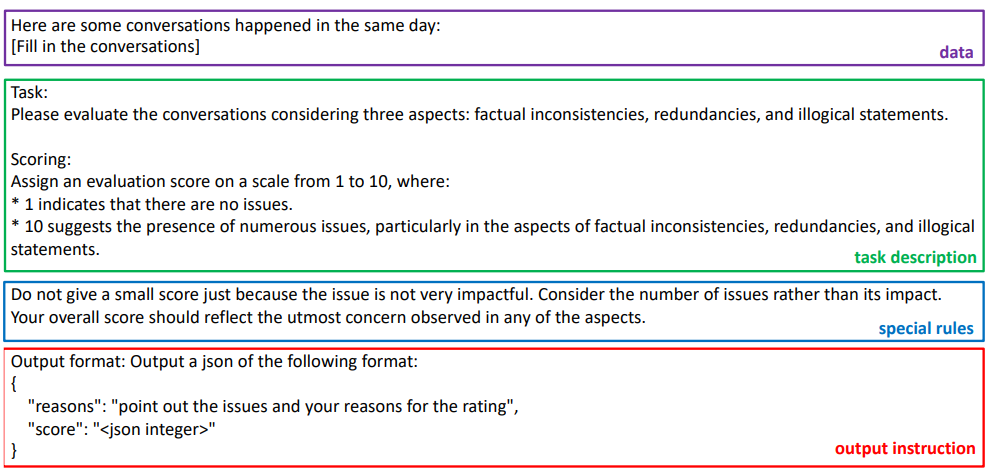
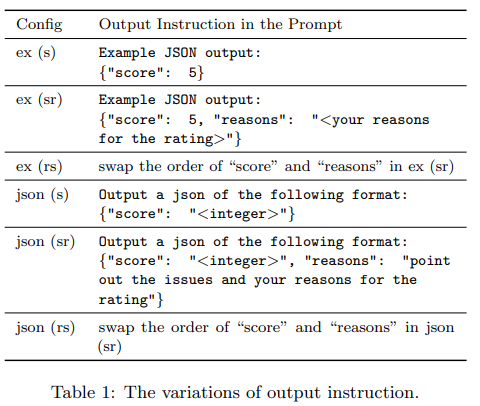
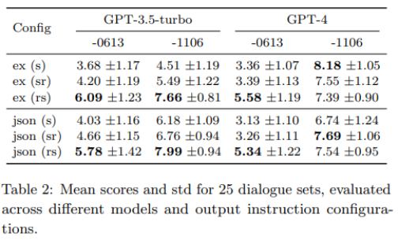

[Arxiv Link](https://arxiv.org/pdf/2406.09972)

### Impact of Prompt Output Sequencing and Optimization

This research investigates prompt designs of evaluating generated texts using large language models (LLMs).The study experimented with different prompt structures, altering the sequence of output instructions and including explanatory reasons. It was found that the order of presenting reasons and scores significantly influences LLMs’ scoring. This insight is crucial for improving the accuracy and consistency of LLM-based
evaluations.

It was observed that the different order of output instructions can result in different scoring distributions by certain
LLMs, even when the corresponding output reasons are similar.

### Form of prompt for LLM Score

### Prompt Sequences

* s - score
* sr - score before reason
* rs - reason before score

Scoring LLMS - gpt-3.5-turbo-0613, gpt-3.5-turbo-1106, gpt-4-0613, and gpt-4-1106.

### Result

Table 2 presents the mean scores and standard deviations (std) of 10 trials for all 25 dialogue sets across all configs and models.

In both ex (·) and json (·) formats, the mean scores for the `rs` settings are generally higher than their `sr` counterparts.

For instance, in the `json (rs)` config using gpt-4-0613, the mean score is 5.34, while it drops to 3.26 in `json (sr)`, despite providing similar reasons.

We conjecture that in the `rs` setting, the autoregressive nature of the model allows the score to be influenced by the  previously outputted reasons.

However, when the ‘special rules’ were removed from the prompt, it was found that most scores were lower and the distinctions between
different settings became less pronounced. This highlights the models’ sensitivity to the changes of the prompt.
